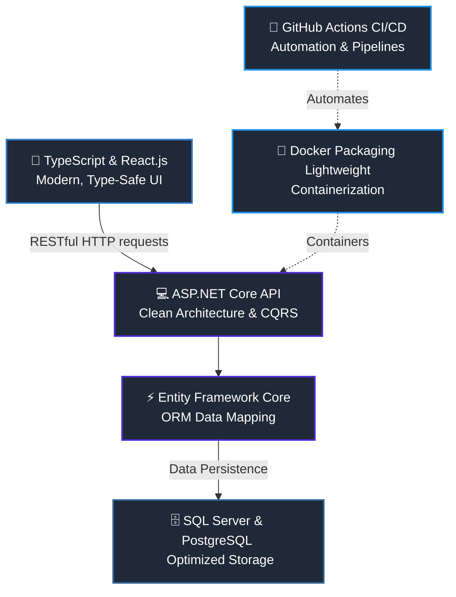

<!-- HEADER SECTION -->
<div align="center">
  <h1>Phan Hoài An</h1>
  <p><strong>FPT University Da Nang | Backend Software Engineer (.NET & C#)</strong></p>
  
  <p align="center">
    <a href="https://linkedin.com/in/phanhoaian1203" target="_blank">
      
    </a>
    <a href="mailto:anph.dev@gmail.com" target="_blank">
      
    </a>
    <a href="https://facebook.com/phanhoaian1203" target="_blank">
      
    </a>
  </p>
</div>

<br />

<!-- CODELANDING / PERSONALIZED IDENTITY -->
```csharp
// PhanHoaiAn.cs
using System;
using System.Threading.Tasks;

namespace DeveloperProfile
{
    public class PhanHoaiAn : BackendDeveloper
    {
        public string Education   => "FPT University Da Nang 🎓";
        public string PrimaryCore => "C# / .NET Core / ASP.NET Web API";
        public string Frontend    => "TypeScript / React.js";
        public string Databases   => "SQL Server & PostgreSQL";
        public string DevOps      => "Docker & GitHub Actions CI/CD";

        public async Task EngineeringGoalAsync()
        {
            await ImplementCleanArchitectureAsync();
            await BuildScalableServicesAsync();
            await ContainerizeAndAutomateAsync();
        }
    }
}
```

---

## 🌟 Professional Blueprint & Philosophy

As a software engineering student at **FPT University Da Nang**, I specialize in building highly scalable, performant backend architectures while bridging the gap to the client layer using modern frontend technologies. I believe software engineering is about crafting reliable systems, automating workflows, and writing self-documenting code.

- 🛠️ **System Mindset:** Writing code with SOLID principles, design patterns, and clean architecture.
- 🐳 **Automation First:** Streamlining deployment via multi-stage Docker builds and automated CI/CD pipelines.
- ⚡ **Performance & Quality:** Designing optimal SQL queries and database schemas for quick execution.

---

## 📊 Tech Stack System Architecture

Unlike generic lists, here is how my technical skills connect and interact within a production system architecture:



---

## 🛠️ Technical Stack & Tools

* **Languages & Core:** 
  
  
  
  

* **Backend & Web Frameworks:**
  
  
  

* **Databases & Infrastructure:**
  
  

* **DevOps & Developer Tools:**
  
  
  
  
  

---

## 📁 Featured Projects

| Project Name | Scope & System Architecture | Core Tech Stack | Repo Link |
| :--- | :--- | :--- | :---: |
| **🚀 Enterprise E-Commerce API** | High-performance REST API incorporating Clean Architecture, CQRS pattern, and secure JWT authentication. | `.NET 8`, `EF Core`, `SQL Server`, `Docker` | [📂 View Repo](https://github.com/phanhoaian1203) |
| **🎨 Management Control Center** | Client-side dashboard focusing on type-safe components, structured state, and smooth UI/UX workflows. | `React`, `TypeScript`, `Tailwind CSS`, `PostgreSQL` | [📂 View Repo](https://github.com/phanhoaian1203) |
| **🔄 Automated Deployment Pipeline** | Automated CI/CD workflow packaging lightweight multi-stage Docker builds onto live servers. | `Docker`, `GitHub Actions`, `Linux` | [📂 View Repo](https://github.com/phanhoaian1203) |

---

## 📊 System Metrics & Analytics

<div align="center">
  <table border="0" cellpadding="0" cellspacing="0">
    <tr>
      <td>
        <a href="https://github.com/phanhoaian1203">
          
        </a>
      </td>
      <td>
        <a href="https://github.com/phanhoaian1203">
          
        </a>
      </td>
    </tr>
  </table>
  
  <br />
  
  <a href="https://github.com/phanhoaian1203">
    
  </a>
  
  <br /><br />
  
  <!-- VISITOR COUNTER -->
  
</div>
